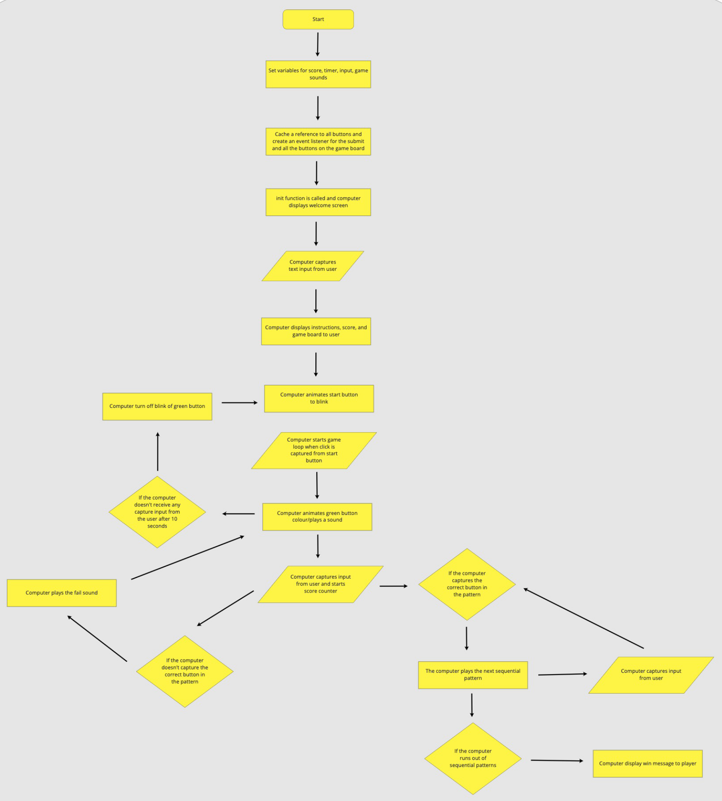

# Simon Game

The game I chose for my first project is Simon.  I was inspired to make this game as I really liked to play this game when I was a kid.  I also thing it will present a good challenge for me in my coding journey.

## User Stories

As a user I want the game to personal to me

As a user I want to see my score

As a user I want the game to be easy to start and easy to reset

## Wireframe

<iframe style="border: 1px solid rgba(0, 0, 0, 0.1);" width="800" height="450" src="https://www.figma.com/embed?embed_host=share&url=https%3A%2F%2Fwww.figma.com%2Ffile%2FM4ZNCjbKyDJBANpsFDYBn7%2FSimon-Wireframe%3Fnode-id%3D1%253A2" allowfullscreen></iframe>

