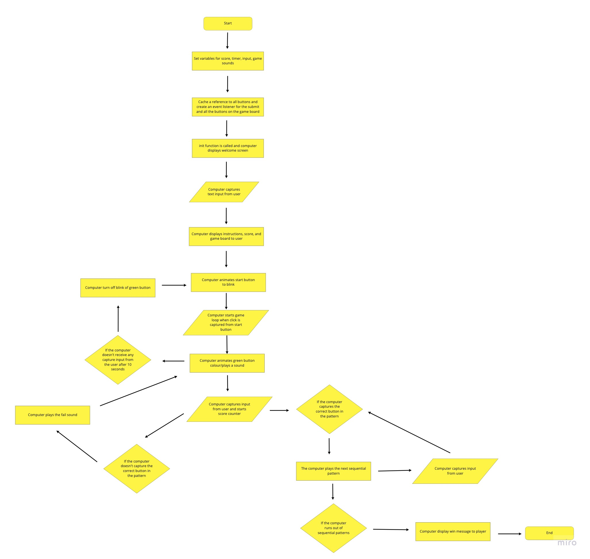

# Simon - Browser Game

The game I chose for my first project is Simon.  I was inspired to make this game as I really liked to play this game when I was a kid.  I also thing it will present a good challenge for me in my coding journey.

## User Stories

As a user I want the game to know my name when I provide it

As a user I want to see my score

As a user I want the game to be easy to start as well as reset

As a user I want the game to have simple and clear instructions so I can easily understand how to play

## Rules to Simon

[Link to document](https://docs.google.com/document/d/1PZ9YwoeWGahjrJURP2c_sXJhdLENRYsss8-CMEqDNDU/edit?usp=sharing)

## Wireframe

[Link to Figma Wireframe](https://www.figma.com/proto/M4ZNCjbKyDJBANpsFDYBn7/Simon-Wireframe?node-id=1%3A2&scaling=min-zoom&page-id=0%3A1)

## Coding Flow Chart
To see a hi-res version of the image, click on it or click on the flow chart in [Miro](https://miro.com/app/board/o9J_lBrbB_Q=/)

## Project Plan

### Deadline Monday May 31st, 2021

MVP 1.0 - Get two buttons working and should be able to be clicked on by the user.  Also, a win/loss condition must appear to the user.

### Deadline Tuesday June 1st, 2021

MVP 2.0 - Get game working with all 4 buttons

### Deadline Wednesday June 2nd, 2021

MVP 3.0 - UI upgrades, sound, animation integration 

### Deadline Thursday June 3rd, 2021

MVP 4.0 - Fix any bugs, dry up code, add difficulty changer to the game and any other interesting features that I decide to add

### Delivery Friday June 4th, 2021

MVP 5.0 - Present final Simon Game

### Ideas

The idea for the algorithm of the game loop is that every time the player clicks on the button we grab the value of button and push that value inside an array.  Then we do a comparison between the pattern array and the new array.